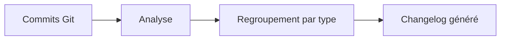

# Changelog Generator

Génération automatique de changelogs à partir de l'historique Git.

## Contexte

Rédiger manuellement des notes de version est fastidieux. Ce skill analyse les commits Git. Il génère un changelog structuré automatiquement.

## Utilisation

- `Crée un changelog depuis le dernier release`
- `Génère les notes de version pour les commits de la semaine`

## Fonctionnement

Le skill s'appuie sur la convention **Conventional Commits** (messages de commit structurés du type `feat:`, `fix:`, `docs:`). Il regroupe les commits par catégorie pour produire un document lisible.

Le changelog regroupe les commits en catégories :
- Nouvelles fonctionnalités
- Corrections
- Autres changements

## Fonctionnalités

- **Analyse des commits** Git depuis un tag ou une date
- **Génération automatique** de notes de version
- **Support Conventional Commits** — regroupe par `feat`, `fix`, `docs`, etc.
