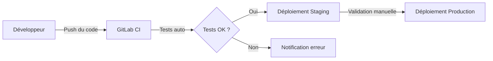

# README Generator

Generates (or updates) a README.md oriented Product Owner, written in French, concise and illustrated with Mermaid diagrams. Also generates CLAUDE.md and AGENT.md if they don't exist.

---

## When to Use

- No README.md exists at the project root
- The existing README.md is outdated after major changes
- After a significant feature addition or architectural change
- Onboarding a Product Owner or new stakeholder on the project

---

## The Job

### Step 1: Explore the Codebase

Thoroughly explore the project to understand its purpose, architecture, and tech stack:

- **Package manifest:** Read `package.json`, `composer.json`, `pyproject.toml`, `Cargo.toml`, or equivalent at root and in sub-packages (monorepo)
- **Project structure:** List top-level directories and key files to understand the architecture
- **Documentation:** Check for `docs/` directory. **Read the first 20-30 lines of each `.md` file in `docs/`** to deduce a short French description (one line) for each — this will be used in the Table of Contents
- **CI/CD:** Look for `.github/workflows/`, `.gitlab-ci.yml`, `Jenkinsfile`, `Dockerfile`, `docker-compose.yml`
- **Database:** Look for migrations, schemas, Prisma/TypeORM/Sequelize config
- **Routes/Controllers:** Scan for route definitions, API endpoints, controllers
- **Git info:** Run `git log --oneline -10` and `git remote -v` to understand recent activity and hosting
- **Environment:** Look for `.env.example`, environment configuration files

### Step 2: Create or Update

- Check if `README.md` exists at the project root
- **If it does NOT exist:** Create it from scratch using the template below
- **If it DOES exist:** Read the existing content, update factual sections (stack, architecture, features), and **preserve any custom sections** added by the team

### Step 3: Generate the Content

Follow the template defined in the "README Template" section below. All content must be in French, following the writing guidelines.

### Step 4: Write the File

Save `README.md` at the project root.

### Step 5: Generate CLAUDE.md and AGENT.md

**Only if these files do NOT exist at the project root.** If they already exist, do not touch them.

- **CLAUDE.md** — Generate instructions for Claude Code based on codebase exploration (see dedicated section below)
- **AGENT.md** — Generate instructions for autonomous AI agents based on codebase exploration (see dedicated section below)

### Step 6: Confirm

Summarize to the user what was done:
- Which files were created vs. updated
- Key sections included
- Any information that could not be determined and was left as placeholder

---

## README Template

The generated README.md must follow this structure:

### `# [Project Name]`

Short description (1-2 sentences, non-technical). Explain what the product does and who it's for.

### `## Table des matières`

Auto-generated table of contents listing all README sections with anchor links. Include a sub-section for technical documentation:

```markdown
## Table des matières

- [À quoi sert ce produit ?](#à-quoi-sert-ce-produit-)
- [Fonctionnalités principales](#fonctionnalités-principales)
- [Comment ça fonctionne](#comment-ça-fonctionne)
- [Environnements](#environnements)
- [Déploiement](#déploiement)
- [Stack technique](#stack-technique)
- [Documentation complémentaire](#documentation-complémentaire)

### Documentation technique

| Document | Description |
|----------|-------------|
| [Architecture REST & WebSocket](docs/REST-WebSocket-Architecture.md) | Description de l'architecture API |
| [Schéma de base de données](docs/database-schema.md) | Structure des tables et relations |
```

**Important:** The description for each doc file must be deduced from actually reading the file content (Step 1), not invented.

### `## À quoi sert ce produit ?`

Business value explanation. 3-5 bullet points describing what the product enables, from the user's perspective.

### `## Fonctionnalités principales`

List of features oriented toward user benefit. Use bullet points. Focus on what the user can do, not how it's implemented.

### `## Comment ça fonctionne`

High-level architecture diagram using Mermaid `graph LR` or `graph TD`, followed by a short textual explanation.

```markdown
```mermaid
graph LR
    A[Utilisateur] --> B[Application Web]
    B --> C[API Backend]
    C --> D[Base de données]
    C --> E[Services externes]
`` `

L'utilisateur interagit avec l'application web, qui communique avec l'API backend. Le backend gère la logique métier et stocke les données en base.
```

### `## Environnements`

Table with environment information:

```markdown
| Environnement | URL | Description |
|---------------|-----|-------------|
| Développement | `http://localhost:3000` | Environnement local |
| Staging | `https://staging.example.com` | Pré-production |
| Production | `https://app.example.com` | Environnement de production |
```

Use actual URLs if found in config, otherwise use realistic placeholders.

### `## Déploiement`

CI/CD pipeline as a Mermaid `graph LR` diagram, followed by a short explanation.

### `## Stack technique`

Categorized tech stack in 3-5 lines:

```markdown
- **Frontend :** React, TypeScript, TailwindCSS
- **Backend :** Node.js, NestJS, TypeORM
- **Base de données :** PostgreSQL
- **Hébergement :** Docker, GitLab CI/CD
```

### `## Documentation complémentaire`

Links to `docs/` files if they exist. If no docs folder exists, omit this section.

---

## Mermaid Diagram Rules

1. **Labels in French** — All node labels and edge labels must be in French
2. **Maximum 8-10 nodes** per diagram — Keep diagrams readable and high-level
3. **Allowed types:** `graph`, `flowchart`, `sequenceDiagram`
4. **Forbidden types:** `classDiagram`, `erDiagram`, `stateDiagram` (too technical for PO audience)
5. **Textual explanation** under every diagram — The diagram alone is not enough
6. **Simple and clear** — Avoid nested subgraphs, complex conditions, or technical details

### Example Mermaid Diagram



Ce diagramme illustre le pipeline de déploiement continu. Lorsqu'un développeur pousse du code, les tests automatiques se lancent. Si les tests réussissent, le code est déployé en staging puis, après validation manuelle, en production.

---

## French Writing Guidelines

- **Natural and professional French**, use "vous" (vouvoiement)
- **Avoid anglicisms** except for technical terms without French equivalent (WebSocket, Docker, CI/CD, API, etc.)
- **Short sentences:** maximum 20 words per sentence
- **Bullet points preferred** over long paragraphs
- **No technical jargon** — Write for a Product Owner, not a developer
- **No code blocks** in the README (except Mermaid diagrams)
- **Acronyms explained** at first occurrence (ex: "CI/CD (Intégration et Déploiement Continus)")
- **Consistent terminology** throughout the document

---

## Create vs. Update Mode

### Creation Mode (no existing README.md)

Generate all sections from scratch based on codebase exploration.

### Update Mode (README.md already exists)

1. Read the existing README.md
2. Identify which sections match the template
3. Update factual sections (stack, architecture, features, environments) with current codebase state
4. **Preserve custom sections** that don't match the template — they may have been added manually by the team
5. Update the table of contents to reflect all sections

---

## CLAUDE.md Generation

**Only generate if `CLAUDE.md` does not exist at the project root.**

Explore the codebase to deduce and include:

- **Project overview:** One-paragraph summary of what the project is
- **Tech stack and key dependencies** with versions
- **Project structure:** Key directories and their purpose
- **Useful commands:** dev, build, test, lint, migrate, seed — with actual commands found in package.json scripts or Makefile
- **Code conventions:** Naming patterns, file structure patterns, architectural patterns observed (e.g., React hooks, service pattern, controller/route separation)
- **Git workflow:** Branch naming conventions (if observable), commit message patterns (from git log)
- **Key files and directories** that Claude should know about
- **Gotchas and important notes** specific to the project (e.g., monorepo structure, shared packages, environment variables needed)
- **Patterns to follow** when writing new code (deduced from existing code style)

---

## AGENT.md Generation

**Only generate if `AGENT.md` does not exist at the project root.**

Explore the codebase to deduce and include:

- **Project summary and objective** (2-3 sentences)
- **Monorepo structure** and dependencies between packages (if applicable)
- **Essential commands:** install, dev, build, test, migrate, seed — with actual commands
- **Code conventions to respect** when making automated changes
- **Development workflow:** Branches, commits, CI/CD pipeline
- **Important notes for automated modifications:** What to avoid, what to always do, critical files not to modify

---

## Example Output

Here is a condensed example of the expected README format:

```markdown
# Overwatch

Plateforme de supervision applicative permettant de surveiller la santé et les performances de vos applications en temps réel.

## Table des matières

- [À quoi sert ce produit ?](#à-quoi-sert-ce-produit-)
- [Fonctionnalités principales](#fonctionnalités-principales)
- [Comment ça fonctionne](#comment-ça-fonctionne)
- [Environnements](#environnements)
- [Déploiement](#déploiement)
- [Stack technique](#stack-technique)
- [Documentation complémentaire](#documentation-complémentaire)

### Documentation technique

| Document | Description |
|----------|-------------|
| [Architecture API](docs/api-architecture.md) | Vue d'ensemble de l'architecture REST |

## À quoi sert ce produit ?

- Surveiller la disponibilité de vos applications en continu
- Recevoir des alertes en cas de dysfonctionnement
- Visualiser l'historique de santé via des tableaux de bord
- Gérer les environnements de déploiement (dev, staging, production)
- Centraliser la supervision de toutes vos applications

## Fonctionnalités principales

- **Tableau de bord temps réel** — Vue d'ensemble de la santé de toutes vos applications
- **Historique de santé** — Graphiques et métriques sur les performances passées
- **Gestion multi-environnements** — Suivi par environnement de déploiement
- **Alertes automatiques** — Notification en cas de dégradation du service

## Comment ça fonctionne

` ``mermaid
graph LR
    A[Utilisateur] --> B[Interface Web]
    B --> C[API NestJS]
    C --> D[Base PostgreSQL]
    C --> E[Vérification de santé]
    E --> F[Applications surveillées]
` ``

L'utilisateur accède à l'interface web pour consulter l'état de ses applications. L'API backend effectue des vérifications de santé régulières et stocke les résultats en base de données.

## Stack technique

- **Frontend :** React 18, TypeScript, TailwindCSS
- **Backend :** NestJS, TypeORM, PostgreSQL
- **Infrastructure :** Docker, GitLab CI/CD
```

---

## Checklist

Before saving the README.md, verify:

- [ ] All content is in French (except technical terms)
- [ ] Table of contents matches all sections with correct anchor links
- [ ] Documentation technique sub-section lists all `docs/*.md` files with descriptions deduced from content
- [ ] Mermaid diagrams are valid and have max 8-10 nodes
- [ ] Mermaid diagrams use only allowed types (graph, flowchart, sequenceDiagram)
- [ ] Every diagram has a textual explanation below it
- [ ] Labels in Mermaid diagrams are in French
- [ ] No code blocks (except Mermaid)
- [ ] Sentences are under 20 words
- [ ] Vouvoiement used consistently
- [ ] Acronyms explained at first occurrence
- [ ] CLAUDE.md generated only if it did not exist
- [ ] AGENT.md generated only if it did not exist
- [ ] User informed of what was created/updated
